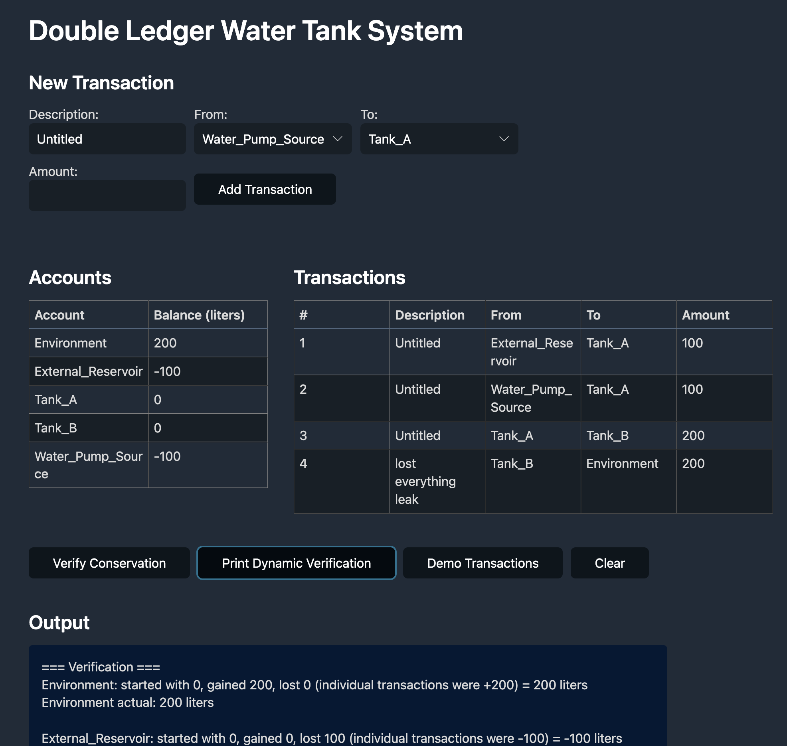
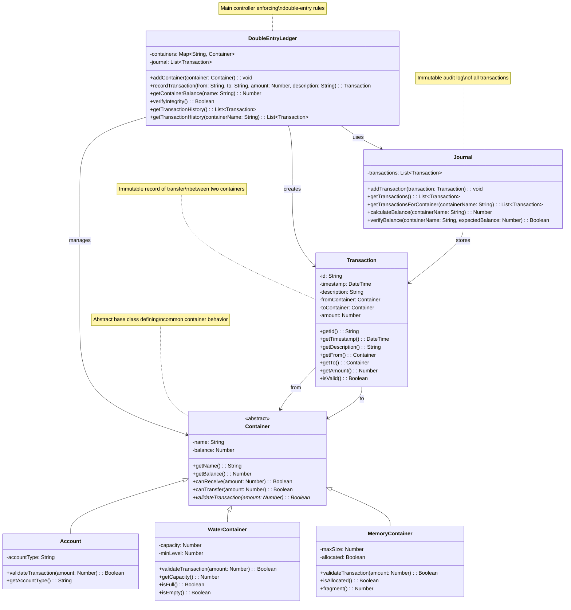

# Double Ledger Design Pattern

The double ledger design pattern could be considered a software architecture approach that applies the principles of double-entry bookkeeping to track resources, changes, and transactions in a system. It ensures that every change is recorded with both a source and a destination, maintaining balance and traceability.

## Example - water tank system

This is an example of Double Ledger applied to a non accounting domain, specifically a water tank system. The system tracks water flow between tanks, ensuring that water is conserved and flows are properly accounted for. Every change has a source and a destination.

[Demo](https://abulka.github.io/double-ledger-pattern/):

 
## Core Concepts

Any implementation of a "double ledger" needs to model:

| Concept      | Description |
|--------------|-------------|
| **Things**   | The resources or entities being tracked. These can be physical items, digital assets, or abstract concepts. Money, water, memory, permissions, etc. |
| **Containers** | Named entities that hold quantities of something. These represent the "places" where your tracked resource can exist. |
| **Transactions** | Atomic operations that move quantities from one container to another. Each transaction must specify source container, destination container, amount, and reason. |

The "double-entry" idea ensures that every transaction is recorded in at least two containers, maintaining a balance between 'debits' and 'credits'.

All verification of such a system needs to iterate through all transactions and show that:
- Every transaction balances (amount out = amount in)
- Container balances match the sum of all transactions affecting them
- Total system quantity of `Things` is conserved (unless explicitly added/removed via designated entry/exit containers)

thus

| Concept      | Description |
|--------------|-------------|
| **Journal** | An immutable log of all transactions in chronological order. This provides the complete audit trail. |
| **Balances** | Current state derived from applying all transactions. These should always be calculable from the transaction history. |

# Discussion

Let's simplify and clarify the Double Ledger Principle for broader use:

This principle is a design approach that focuses on conservation and accountability. At its core, it ensures that nothing appears from nowhere, and nothing disappears into nothing. Every change to a limited resource or system state is recorded as an equal and opposite adjustment. This means if something leaves one "container" or "state," it must simultaneously enter another, guaranteeing the total quantity or state remains consistent and verifiable. It's all about balancing and auditable traceability.

## The "Double" Concept

The "double" in double ledger comes from the fact that **every (atomic) transaction affects exactly two places**:

1. **Something decreases somewhere** (the source container)
2. **Something increases somewhere else** (the destination container)

This creates a natural balance: the total amount lost from all sources always equals the total amount gained by all destinations. The system remains in equilibrium.

## Forces

**Conservation**: The total quantity in your system can only change through well-defined entry and exit points. Nothing is created or destroyed within the system itself.

**Traceability**: Every change has a complete paper trail. You can always answer "where did this come from?" and "where did this go?"

**Atomicity**: Changes happen as complete transfers. You can't have a source decrease without a corresponding destination increase.

**Verification**: The system can self-audit. If your books don't balance, you know something went wrong.

**Invariants**: The double-entry constraint acts as a continuous integrity check, preventing impossible states.

> The key insight is that any system where you need to track **what changed**, **when it changed**, and **why it changed** can benefit from double ledger principles.
> 

## Core Models and Functions

**Essential Data Structures:**
```
Container { name, current_balance, validateTransaction(amount) }
Transaction { id, timestamp, description, from_container, to_container, amount }
Journal { list_of_transactions }
DoubleEntryLedger { containers, journal }
```

**Core Functions:**
```
record_transaction(from, to, amount, description)
get_container_balance(container_name)
verify_system_integrity()
get_transaction_history(container_name)
calculate_balance_from_history(container_name)
```

## UML




## Use in Software

Although double ledger comes from the world of accounting, the ideas can be applied to other disciplines and solve many software engineering challenges. Here are some examples:

**Accounting Implementation:**
- **Containers**: Account("Cash"), Account("Accounts_Receivable"), Account("Inventory"), Account("Revenue")
- **Transactions**: "Sale of goods", "Payment received", "Purchase supplies"
- **Verification**: Assets = Liabilities + Equity

**Water System (Demo):**
- **Containers**: WaterContainer("Tank_A"), WaterContainer("Tank_B"), WaterContainer("Environment"), WaterContainer("Water_Source")
- **Transactions**: "Transfer between tanks", "Fill from source", "Leak to environment"
- **Verification**: Total water volume conserved

**Memory Allocation/Deallocation:**
- **Containers**: MemoryContainer("Free_Heap"), MemoryContainer("Process_Memory"), MemoryContainer("Allocated_Blocks"), MemoryContainer("Memory_Pool")
- **Transactions**: "malloc()", "free()", "garbage_collect()"
- **Verification**: Total memory = Free + Allocated

### Real-World Applications

Here are some more real wold examples of the Double Ledger Principle in Non-Accounting Domains

These systems don't use "debits" and "credits" but fundamentally rely on the principle of ensuring that what goes "out" of one pool/state must go "into" another, or be explicitly "consumed" or "created," with the total always balancing.

1.  **Software Memory Management (e.g., Operating Systems, Runtime Environments)**
    * **Finite Resource**: Total available RAM (or heap memory).
    * **"Containers/States"**: "Free Memory Pool" vs. "Allocated Memory Blocks" (per process/application).
    * **Principle in Action**: When a `malloc()` call requests memory, it reduces the "Free Memory Pool" by a specific amount and *simultaneously* increases "Allocated Memory Blocks" for the requesting process by the exact same amount. When `free()` is called, the opposite occurs. The sum of free and allocated memory always equals the total memory managed by the allocator. This ensures no memory is lost or accidentally created, preventing leaks or corruption.
    * **Evidence**: Standard operating system memory allocators (e.g., `buddy system`, `slab allocator`) and runtime garbage collectors intrinsically operate on this principle to maintain memory integrity.

2.  **Physical Inventory Management (Non-Financial)**
    * **Finite Resource**: Specific items/SKUs in stock.
    * **"Containers/States"**: "In Stock (Warehouse A)", "In Transit (to Warehouse B)", "Consumed (Sold/Scrapped)".
    * **Principle in Action**: When 10 units are shipped from Warehouse A to Warehouse B, Warehouse A's count decreases by 10, and Warehouse B's (or "In Transit" count) increases by 10. When items are "received" into a warehouse, their "In Transit" status is decremented, and the "In Stock" count is incremented. Every movement is a transfer between states or locations, maintaining a consistent total.
    * **Evidence**: Widely used in supply chain management software, warehouse management systems (WMS), and logistics to track physical goods. Discrepancies (like loss/theft) are immediately identifiable as a violation of this balance, triggering investigations.

3.  **Water/Resource Flow Simulations**
    * **Finite Resource**: Volume of water (or any fluid/gas).
    * **"Containers/States"**: "Tank A", "Tank B", "Reservoir", "Environment (leak/evaporation)".
    * **Principle in Action**: If 100 liters of water are transferred from Tank A to Tank B, Tank A's volume decreases by 100L, and Tank B's volume increases by 100L. If 50L leaks to the "Environment," Tank A decreases by 50L, and the "Environment" (or "Loss") account increases by 50L. The total water within the system (or accounted for as loss) always sums to the initial amount plus any external inputs.
    * **Evidence**: Core principle in hydrological modeling, fluid dynamics simulations, and process engineering (e.g., mass balance equations).


### More Examples

These example areas leverage the *idea* of balancing inputs and outputs for integrity, even if the "containers" or "resources" are more abstract.

* **System Resource Allocation (e.g., CPU Time, Network Bandwidth)**: While not a fixed "total," managing quotas (e.g., User A gets 20% of CPU, User B gets 30%) implies that the sum of allocated percentages doesn't exceed 100%. If more is allocated to one, it must be "taken" from another or from a "free" pool.
* **Data Lineage and Provenance**: Tracking where data came from, what transformations it underwent, and where it went. Every "output" from one process becomes an "input" to another, forming a verifiable chain.
* **Feature Flag Rollout Tracking**: Users move between "Has Feature X" and "Does Not Have Feature X" groups. A user moving out of one group must enter the other, ensuring all users are accounted for.
* **Game Resource Management (Health, Mana, Inventory)**: When a player uses an item (e.g., "mana potion"), their inventory of that item decreases, and their "mana" resource increases. When a spell is cast, "mana" decreases. The "transaction" of using an item or casting a spell involves a balanced change across multiple internal "accounts" (mana pool, inventory count).

By focusing on the underlying principle of conservation, balanced adjustments, and auditable traceability of a finite or managed resource, we can see that the "double ledger" mindset extends far beyond traditional accounting, offering a robust foundation for integrity in various complex systems.


## Appendix

### Demos

Visit the [demo page](https://abulka.github.io/double-ledger-pattern/) to see the double ledger in action with a water tank system. Built with JavaScript and HTML, this demo allows you to interactively transfer water between tanks, demonstrating the double ledger principles in a non-accounting context. (See screenshot above).

Python Example: Download [this repository](https://github.com/abulka/double-ledger-pattern) (or just the file `main.py`) and run `python3 main.py` to see the double ledger in action with a water tank system.

<details>
<summary>Example Python output:</summary>

```
=== Water Tank System Demo ===
Tracking water transfers - every drop must come from somewhere and go somewhere

✓ Fill Tank A from reservoir
  External_Reservoir: -100 (now -100)
  Tank_A: +100 (now 100)

Total water in system: 0 liters
Current Balances:
  External_Reservoir: -100 liters
  Tank_A: 100 liters

✓ Transfer from Tank A to Tank B
  Tank_A: -30 (now 70)
  Tank_B: +30 (now 30)

Total water in system: 0 liters
Current Balances:
  External_Reservoir: -100 liters
  Tank_A: 70 liters
  Tank_B: 30 liters

✓ Pump water into Tank A
  Water_Pump_Source: -20 (now -20)
  Tank_A: +20 (now 90)

Total water in system: 0 liters
Current Balances:
  External_Reservoir: -100 liters
  Tank_A: 90 liters
  Tank_B: 30 liters
  Water_Pump_Source: -20 liters

✓ Tank B leaks to ground
  Tank_B: -5 (now 25)
  Environment: +5 (now 5)

Total water in system: 0 liters
Current Balances:
  External_Reservoir: -100 liters
  Tank_A: 90 liters
  Tank_B: 25 liters
  Water_Pump_Source: -20 liters
  Environment: 5 liters

Current Balances:
  External_Reservoir: -100 liters
  Tank_A: 90 liters
  Tank_B: 25 liters
  Water_Pump_Source: -20 liters
  Environment: 5 liters

=== Verification ===
Environment: started with 0, gained 5, lost 0 (+5) = 5 liters
Environment actual: 5 liters

External_Reservoir: started with 0, gained 0, lost 100 (-100) = -100 liters
External_Reservoir actual: -100 liters

Tank_A: started with 0, gained 120, lost 30 (+100, -30, +20) = 90 liters
Tank_A actual: 90 liters

Tank_B: started with 0, gained 30, lost 5 (+30, -5) = 25 liters
Tank_B actual: 25 liters

Water_Pump_Source: started with 0, gained 0, lost 20 (-20) = -20 liters
Water_Pump_Source actual: -20 liters

=== Conservation Check ===
Total water in system: 0 liters
Notice: Total water = 0 because we track sources as negative
This makes sense: we 'borrowed' 120L from external sources,
and now have 90+25+5 = 120L in our system

=== Transaction History ===
1. Fill Tank A from reservoir: 100L from External_Reservoir to Tank_A
2. Transfer from Tank A to Tank B: 30L from Tank_A to Tank_B
3. Pump water into Tank A: 20L from Water_Pump_Source to Tank_A
4. Tank B leaks to ground: 5L from Tank_B to Environment
```

</details>

### See also

- An [article](https://pgrs.net/2025/06/17/double-entry-ledgers-missing-primitive-in-modern-software/?utm_source=tldrnewsletter) that partly inspired this project

- AI [chat](https://claude.ai/chat/ab298c8f-52ac-4b88-b305-f5bd2df3df77) assistance

- Double Ledger Pattern [Google Search](https://www.google.com/search?q=double+ledger+design+pattern&rlz=1C5CHFA_enAU1062AU1063&oq=double+ledger+design+pattern&gs_lcrp=EgZjaHJvbWUyBggAEEUYOdIBCDU0NjdqMGo3qAIIsAIB&sourceid=chrome&ie=UTF-8)

- Andy Bulka's [Other Design Patterns](https://abulka.github.io/patterns/)